# Project 03 - DHCP, NAT/PAT, and Default Route Configuration

## Project Overview

This project demonstrates DHCP, NAT/PAT, and default route configuration using Cisco IOS in EVE-NG.

The topology simulates a small office network where internal PCs receive IP addresses automatically from Router1 using DHCP. Router1 also performs NAT/PAT so internal private IP addresses can reach the simulated ISP network.

This project includes both implementation and troubleshooting. Several configuration mistakes were intentionally added, then fixed and verified using Cisco IOS commands.

---

## Technologies Used

- Cisco IOS CLI
- EVE-NG
- VPCS
- DHCP
- NAT/PAT
- Default Route
- Static Routing
- Basic LAN Switching

---

## Network Topology

The topology uses two PCs connected to a switch. The switch connects to Router1, and Router1 connects to an ISP router.

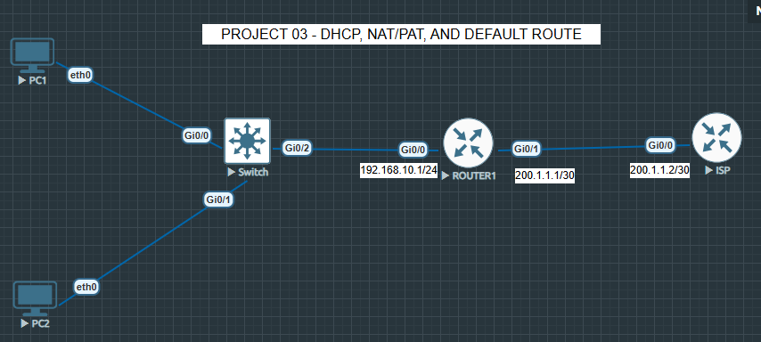

### Topology Purpose

- PC1 and PC2 represent internal LAN users.
- The switch connects the internal LAN devices.
- Router1 acts as the LAN gateway, DHCP server, and NAT/PAT device.
- The ISP router represents the outside network.
- NAT/PAT allows private LAN devices to communicate with the ISP network using Router1’s outside interface.

---

## IP Addressing Plan

| Device | Interface | IP Address | Purpose |
|---|---|---|---|
| Router1 | G0/0 | 192.168.10.1/24 | LAN gateway |
| Router1 | G0/1 | 200.1.1.1/30 | Outside/WAN interface |
| ISP | G0/0 | 200.1.1.2/30 | ISP-side interface |
| PC1 | DHCP | 192.168.10.100/24 | LAN client |
| PC2 | DHCP | 192.168.10.101/24 | LAN client |

---

## Intentional Issues Added

The following issues were intentionally configured for troubleshooting practice:

- DHCP pool used the wrong default gateway.
- NAT ACL matched the wrong network.
- NAT inside/outside was missing or misconfigured.
- Default route pointed to the wrong next-hop.
- ISP interface was shutdown.
- NAT translation table was empty before correction.

---

# Troubleshooting Evidence

## 1. PC1 Received Wrong DHCP Gateway

PC1 received an IP address from DHCP, but the gateway was incorrect.

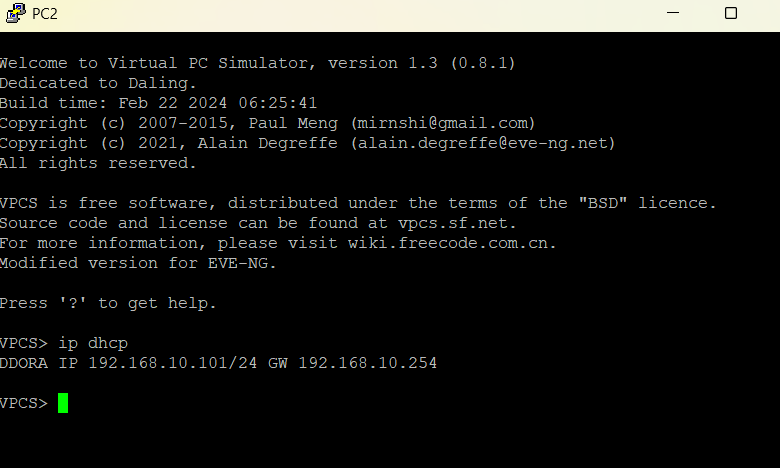

---

## 2. PC2 Received Wrong DHCP Gateway

PC2 also received an incorrect gateway from DHCP.

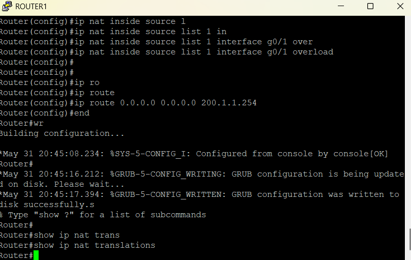

---

## 3. NAT Translation Table Empty

Before fixing NAT, there were no NAT translations.

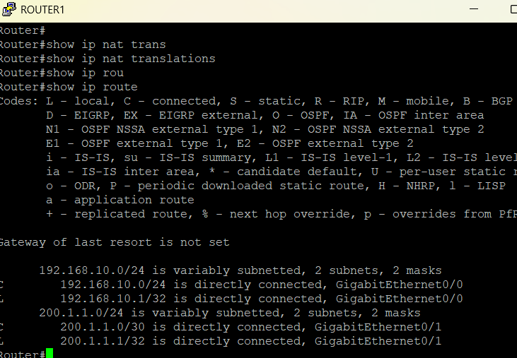

---

## 4. No Correct Default Route

The routing table showed that the correct default route was missing.

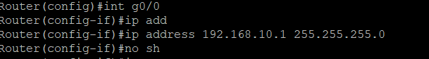

---

## 5. Router1 LAN Interface Configuration

Router1 LAN interface was configured as the internal gateway.

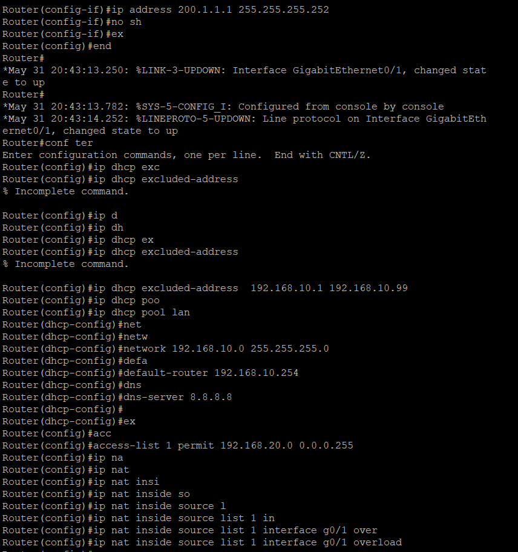

---

## 6. DHCP Pool Had Wrong Gateway

The DHCP pool used the wrong default-router value.

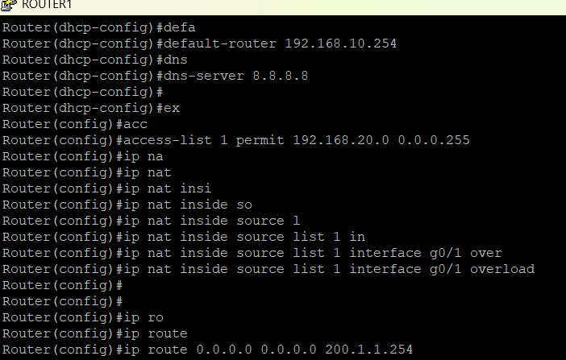

### Fix Applied

```bash
ip dhcp pool LAN
default-router 192.168.10.1
```

---

## 7. NAT ACL Used Wrong Network

The NAT access list was initially matching the wrong network.

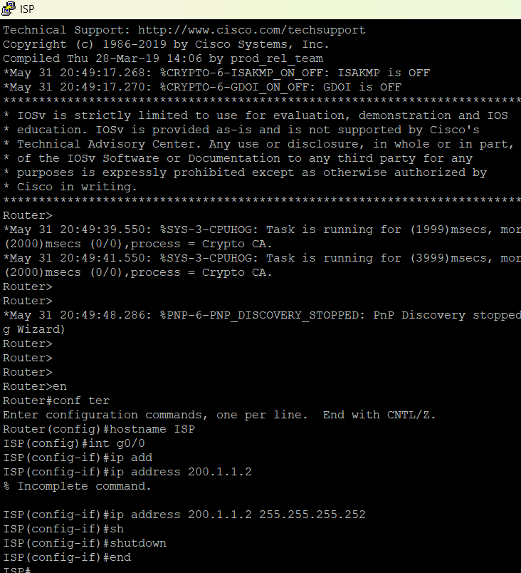

### Fix Applied

```bash
no access-list 1
access-list 1 permit 192.168.10.0 0.0.0.255
```

---

## 8. ISP Router Interface Configuration

The ISP router interface was configured with the outside network IP address.

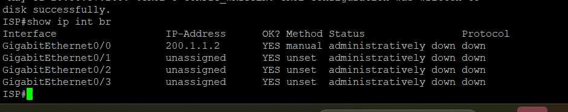

---

## 9. ISP Interface Shutdown State

The ISP interface was administratively down, preventing outside connectivity.

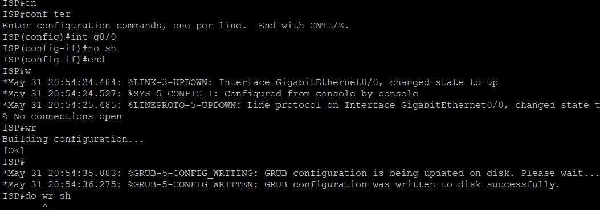

---

## 10. ISP Interface Fixed

The ISP interface was enabled using `no shutdown`.

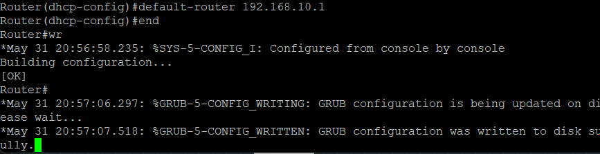

### Fix Applied

```bash
interface g0/0
no shutdown
```

---

## 11. DHCP Gateway Fixed

The DHCP default gateway was corrected to Router1’s LAN IP address.


---

## 12. PC1 Received Correct DHCP Information

After the fix, PC1 received the correct gateway.


---

## 13. PC2 Received Correct DHCP Information

After the fix, PC2 also received the correct gateway.


---

## 14. NAT ACL Fixed

The NAT ACL was corrected to match the LAN network.

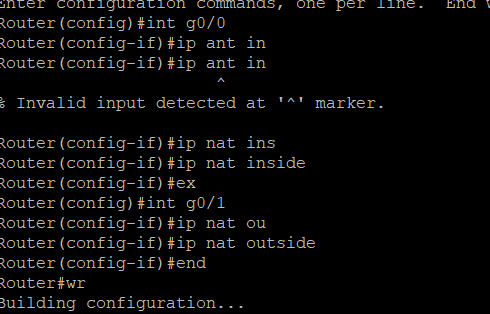

---

## 15. NAT Inside and Outside Interfaces Fixed

Router1 LAN interface was configured as NAT inside, and WAN interface was configured as NAT outside.

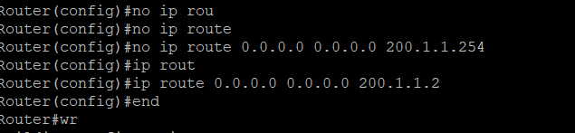

### Fix Applied

```bash
interface g0/0
ip nat inside

interface g0/1
ip nat outside
```

---

## 16. Default Route Fixed

The default route was corrected to point to the ISP router.

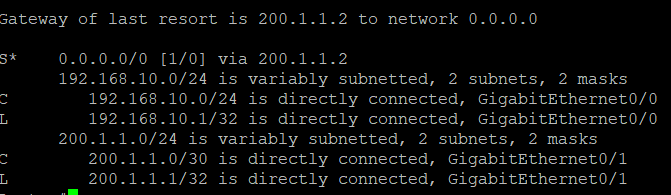

### Fix Applied

```bash
no ip route 0.0.0.0 0.0.0.0 200.1.1.254
ip route 0.0.0.0 0.0.0.0 200.1.1.2
```

---

# Final Verification

## Successful Ping to ISP

PCs were able to reach the ISP router after DHCP, NAT/PAT, and default route fixes.

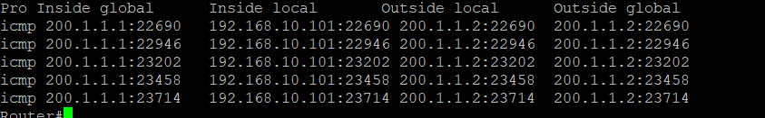

---

## ISP Interface Up

The ISP interface was verified as up.

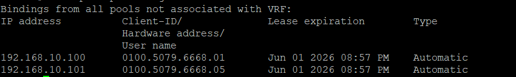

---

## DHCP Binding Verification

Router1 successfully assigned DHCP addresses to PC1 and PC2.


---

## NAT Translation Verification

NAT/PAT translations were successfully created after traffic was sent from the LAN to the ISP network.

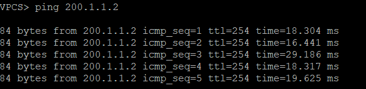

---

# Final Working Configuration Summary

## Router1 Key Configuration

```bash
interface g0/0
ip address 192.168.10.1 255.255.255.0
ip nat inside
no shutdown

interface g0/1
ip address 200.1.1.1 255.255.255.252
ip nat outside
no shutdown

ip dhcp excluded-address 192.168.10.1 192.168.10.99

ip dhcp pool LAN
network 192.168.10.0 255.255.255.0
default-router 192.168.10.1
dns-server 8.8.8.8

access-list 1 permit 192.168.10.0 0.0.0.255

ip nat inside source list 1 interface g0/1 overload

ip route 0.0.0.0 0.0.0.0 200.1.1.2
```

## ISP Key Configuration

```bash
interface g0/0
ip address 200.1.1.2 255.255.255.252
no shutdown
```

---

# Verification Commands Used

```bash
show ip interface brief
show ip dhcp binding
show ip nat translations
show ip route
ping
```

---

# Skills Demonstrated

- DHCP server configuration
- DHCP troubleshooting
- NAT/PAT configuration
- NAT inside/outside interface assignment
- NAT ACL troubleshooting
- Default route configuration
- ISP connectivity simulation
- Cisco IOS troubleshooting
- End-to-end network verification

---

# Result

DHCP successfully assigned IP addresses to LAN clients, NAT/PAT translated internal private IP addresses to the outside interface, and the corrected default route allowed successful communication from the LAN to the ISP network.
