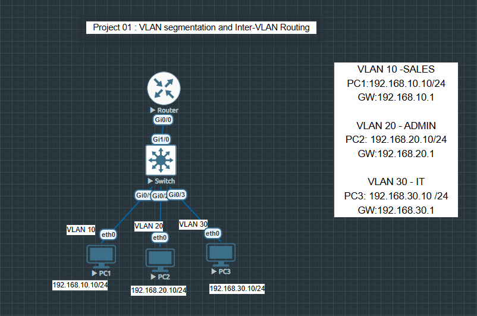

# Project 01: VLAN, Trunking, and Inter-VLAN Routing

## Objective

Build a small enterprise network using VLAN segmentation, trunk links, and inter-VLAN routing.

## Technologies Used

- VLANs
- Access ports
- Trunk ports
- Router-on-a-stick
- Subinterfaces
- Default gateway
- Cisco Packet Tracer / EVE-NG

## Network Design

This lab uses multiple VLANs to separate departments and allows communication between VLANs using inter-VLAN routing.

## VLANs

| VLAN | Name | Network |
|---|---|---|
| VLAN 10 | Sales | 192.168.10.0/24 |
| VLAN 20 | HR | 192.168.20.0/24 |
| VLAN 30 | IT | 192.168.30.0/24 |


## Project Screenshots

### Network Topology


### Router Interface Status


### Routing Table


### Trunk Configuration


### Running Configuration


### Troubleshooting Evidence - Wrong Trunk Port Configuration


### Successful Ping Test


## Configuration Summary

- Created VLANs on the switch
- Assigned access ports to VLANs
- Configured trunk link between switch and router
- Configured router subinterfaces
- Added IP addresses as default gateways
- Verified connectivity using ping and show commands

## Verification Commands

```bash
show vlan brief
show interfaces trunk
show ip interface brief
show ip route
ping
