Markdown
# Project 02 - OSPF Routing Troubleshooting

## Project Overview

This project demonstrates OSPF routing configuration and troubleshooting using three Cisco routers connected in a triangle topology.

The lab was intentionally configured with multiple routing issues to simulate real troubleshooting scenarios commonly encountered in enterprise networks.

---

# Technologies Used

- Cisco IOS CLI
- OSPF Routing Protocol
- EVE-NG
- VPCS

---

# Network Topology

The network uses /30 point-to-point links between routers and /24 LAN networks for PCs.

## Topology Diagram

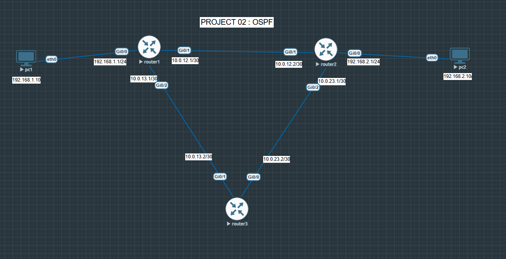

---

# Troubleshooting Scenarios

The following issues were intentionally introduced into the lab:

- R1 G0/1 interface shutdown
- OSPF area mismatch
- Missing OSPF advertisements
- Wrong PC default gateway
- Neighbor adjacency failure

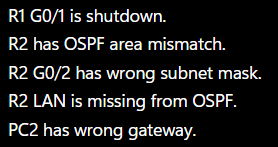

---

# R1 Interface Shutdown Issue

R1 GigabitEthernet0/1 was administratively down, preventing OSPF adjacency formation with R2.

Verification command used:

```bash
show ip interface brief
```

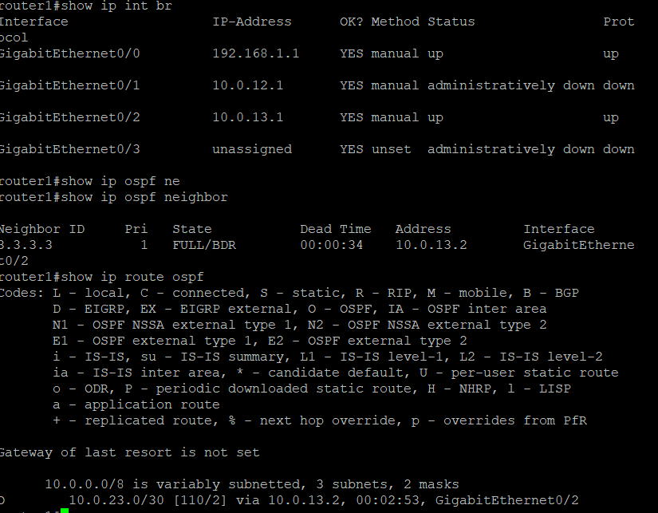

### Fix Applied

```bash
conf t
interface g0/1
no shutdown
```

After enabling the interface, connectivity between routers was restored.

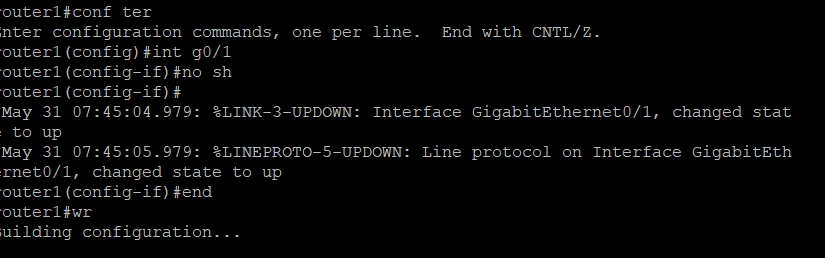

---

# OSPF Area Mismatch

R2 was configured with the wrong OSPF area, causing neighbor relationships to fail.

The router generated an OSPF area mismatch message during adjacency attempts.

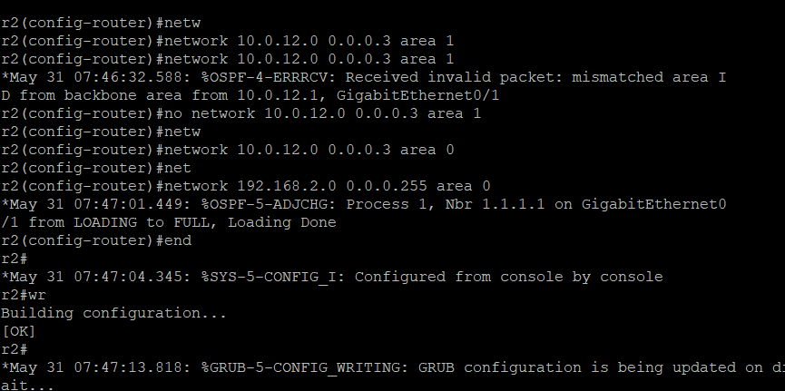

### Incorrect Configuration

```bash
network 10.0.12.0 0.0.0.3 area 1
```

### Corrected Configuration

```bash
no network 10.0.12.0 0.0.0.3 area 1
network 10.0.12.0 0.0.0.3 area 0
```

---

# Initial OSPF Neighbor Failure

Before troubleshooting, routers were unable to establish FULL OSPF neighbor relationships.

Verification command used:

```bash
show ip ospf neighbor
```

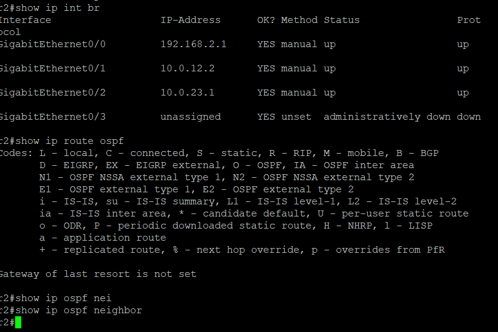

---

# Router 3 Routing Verification Before Fix

Router 3 initially had incomplete routing information due to the OSPF problems.

Verification command used:

```bash
show ip route ospf
```

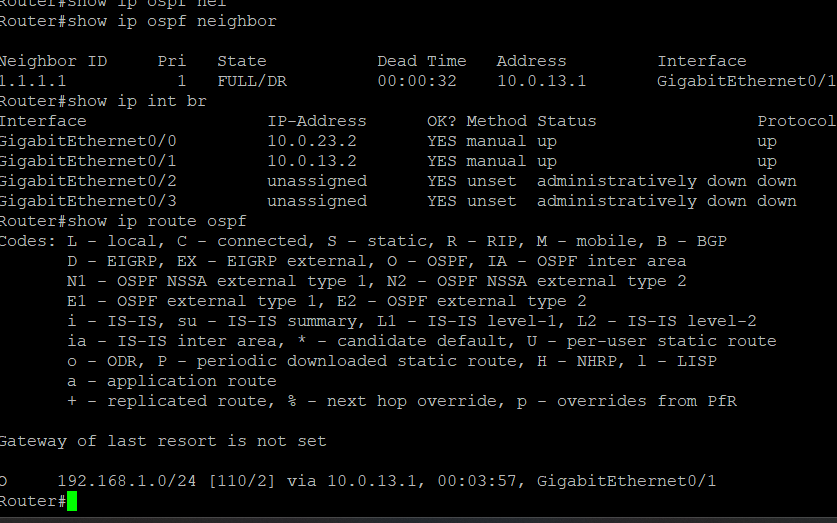

---

# OSPF Neighbor Recovery

After correcting the configuration issues, all routers successfully formed FULL OSPF neighbor relationships.

Neighbor verification:

```bash
show ip ospf neighbor
```

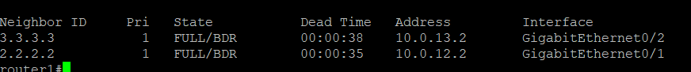

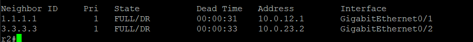

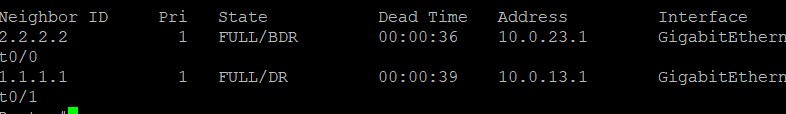

---

# Wrong Gateway Issue

PC2 was initially configured with the wrong default gateway, preventing communication with remote networks.

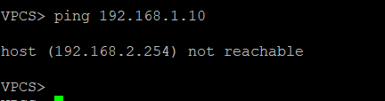

### Correct Gateway

```bash
192.168.2.1
```

After correcting the gateway, end-to-end communication became successful.

---

# End-to-End Connectivity Test

Final connectivity testing confirmed successful routing between LAN networks.

Ping test used:

```bash
ping 192.168.1.10
```

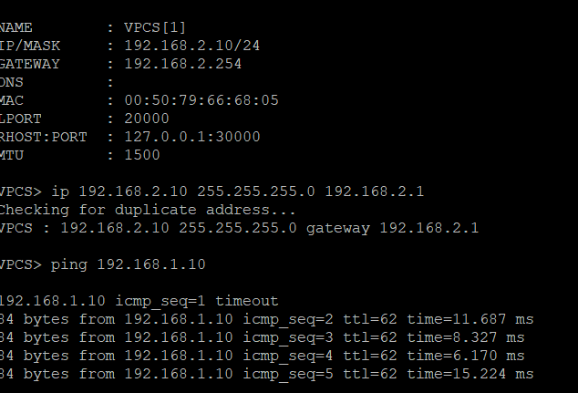

The successful replies verified that OSPF routing and network communication were fully restored.

---

# Skills Practiced

- OSPF configuration
- OSPF troubleshooting
- Interface troubleshooting
- Neighbor adjacency troubleshooting
- Routing verification
- Gateway troubleshooting
- Cisco CLI verification commands

---

# Verification Commands Used

```bash
show ip interface brief
show ip ospf neighbor
show ip route ospf
show running-config
ping
```
