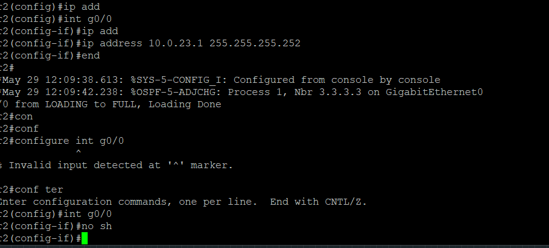

# Project 02 - OSPF Routing Troubleshooting Lab

## Objective
The goal of this project was to configure and troubleshoot OSPF routing between three Cisco routers using EVE-NG.  
This lab was created to practice real CCNA-level routing configuration and troubleshooting scenarios.

## Technologies Used
- OSPF (Open Shortest Path First)
- IPv4 Addressing
- Cisco IOS CLI
- EVE-NG
- VPCS
- Routing Troubleshooting

---

# Network Topology


The network consists of three routers connected in a triangle topology.  
Each router uses /30 point-to-point links for router-to-router communication.

Router 1 and Router 2 each have a LAN network connected to a PC:
- PC1 → 192.168.1.10/24
- PC2 → 192.168.2.10/24

The purpose of OSPF in this lab was to allow both LAN networks to communicate dynamically through routing updates.

---

# Initial Problem Encountered

During configuration, OSPF neighbors were not forming correctly because one router interface was administratively down.


This was verified using:

```bash
show ip interface brief
```

The output showed that interface G0/1 was in an administratively down state.

---

# Fix Applied

The interface was enabled using:

```bash
interface g0/1
no shutdown
```

After enabling the interface, the OSPF adjacency process immediately started forming.


---

# OSPF Neighbor Formation

Before the fix, only partial neighbor relationships were visible.


After correcting the issue, the routers successfully reached FULL OSPF neighbor state.



This confirmed that the routers were successfully exchanging routing information.

Verification command used:

```bash
show ip ospf neighbor
```

---

# OSPF Loading Process

The screenshot below shows the OSPF adjacency process transitioning into FULL state.


This indicates that the routers successfully exchanged LSAs (Link-State Advertisements) and synchronized routing databases.

---

# Routing Table Verification

After OSPF adjacency was established, remote routes appeared in the routing table.


Additional routing verification:


Verification command used:

```bash
show ip route ospf
```

The routing table confirmed that the routers learned remote networks dynamically through OSPF.

---

# End-to-End Connectivity Test

After troubleshooting and verification, successful communication between PCs was tested.


Ping test used:

```bash
ping 192.168.2.10
```

This verified successful routing between different LAN networks.

---

# Skills Practiced

This project helped practice:
- OSPF configuration
- Router interface troubleshooting
- OSPF neighbor verification
- Routing table verification
- IPv4 subnetting
- End-to-end connectivity testing
- Cisco IOS troubleshooting commands

---

# Result

Successfully configured and troubleshooted OSPF routing between three Cisco routers using EVE-NG.  
Verified dynamic route learning, OSPF neighbor adjacency, and successful communication between different LAN networks.
