# Project 04 - ACL Security Configuration

## Project Overview

This project demonstrates the implementation and troubleshooting of Cisco Extended Access Control Lists (ACLs) to control traffic between two LAN networks.

The objective was to block ICMP (ping) traffic from PC1 (192.168.10.10) to PC2 (192.168.20.10) while allowing other traffic to continue operating normally.

---

## Network Topology

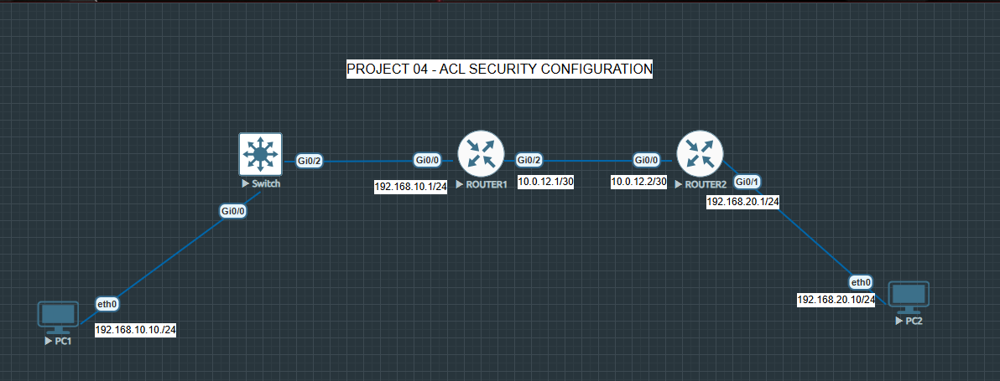

### IP Addressing Plan

| Device | Interface | IP Address |
|----------|-----------|------------|
| PC1 | eth0 | 192.168.10.10/24 |
| Router1 | G0/0 | 192.168.10.1/24 |
| Router1 | G0/2 | 10.0.12.1/30 |
| Router2 | G0/0 | 10.0.12.2/30 |
| Router2 | G0/1 | 192.168.20.1/24 |
| PC2 | eth0 | 192.168.20.10/24 |

---

## Project Objectives

- Configure connectivity between two LANs
- Configure Static Routes
- Implement Extended ACLs
- Block ICMP traffic between hosts
- Troubleshoot ACL configuration issues
- Verify ACL operation using Cisco IOS commands

---

## Connectivity Verification Before ACL

Successful connectivity test before ACL implementation.

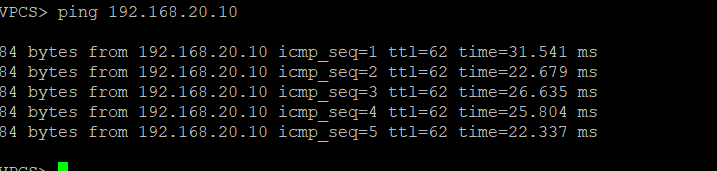

---

# Mistake 1 - Wrong ACL Direction

### Incorrect ACL Configuration

The ACL was created but applied in the wrong direction.

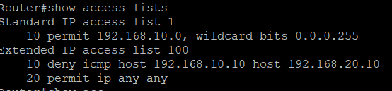

### Verification

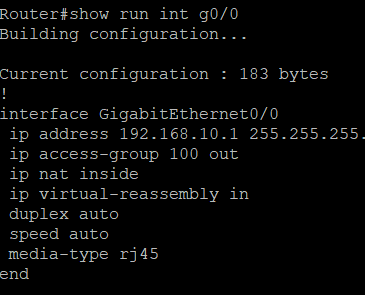

### Result

Traffic was still allowed because the ACL was not filtering packets correctly.

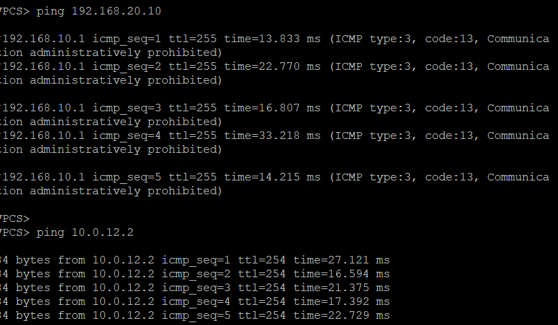

### Explanation

ACLs must be applied to the correct interface and direction. Applying the ACL incorrectly prevents the router from filtering the intended traffic.

---

# Fix 1 - Correct ACL Placement

The ACL was removed and reapplied to the correct interface direction.

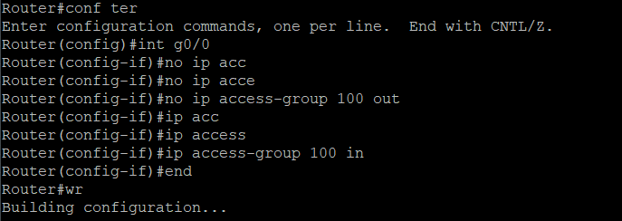

### Result

ICMP traffic is now blocked successfully.

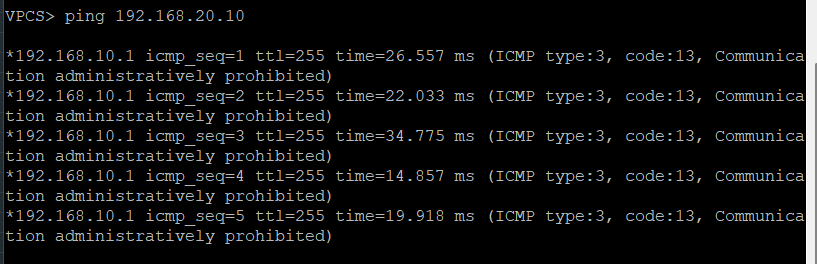

### Explanation

Once applied inbound on Router1 G0/0, the ACL matched the ICMP packets and denied them before routing occurred.

---

# Mistake 2 - Missing Permit Statement

### Incorrect Configuration

Only the deny statement was configured.

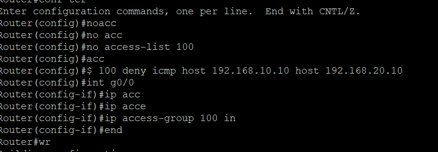

### Problem

Cisco ACLs automatically end with:

```cisco
deny ip any any
```

Without a permit statement, all remaining traffic is blocked.

### Fix

Added:

```cisco
access-list 100 permit ip any any
```

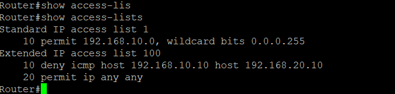

### Explanation

This allows all other traffic that does not match the deny statement.

---

# Mistake 3 - Wrong Source IP Address

### Incorrect ACL Entry

The ACL referenced the wrong source IP address.


### Result

The ping still succeeded.

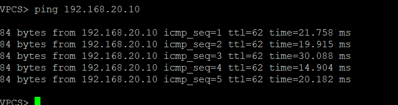

### Explanation

The ACL was matching traffic from a different host, so the actual ping traffic was not affected.

### Fix

Updated the ACL with the correct source address.

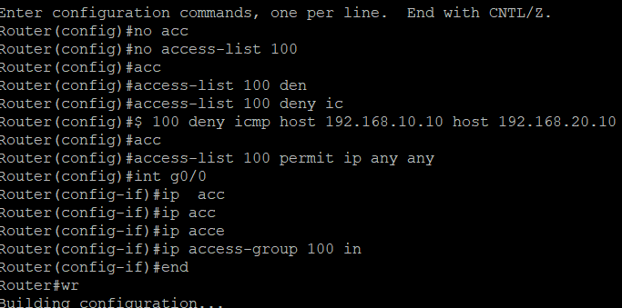

### Result

The ping traffic is now successfully blocked.


---

## Verification Commands

```cisco
show access-lists
show run interface g0/0
show ip route
```

### Verification Output


---

## Final ACL Configuration

```cisco
access-list 100 deny icmp host 192.168.10.10 host 192.168.20.10
access-list 100 permit ip any any

interface g0/0
 ip access-group 100 in
```

---

## Skills Demonstrated

- Extended ACL Configuration
- ICMP Traffic Filtering
- Static Routing
- ACL Placement and Direction
- ACL Troubleshooting
- Cisco IOS Verification Commands
- Network Security Fundamentals
- Packet Filtering

---

## Technologies Used

- Cisco IOSv
- EVE-NG
- VPCS (Virtual PC Simulator)
- Static Routing
- Extended Access Control Lists (ACL)

---

## Project Outcome

Successfully configured and troubleshot Cisco Extended ACLs to block ICMP traffic from PC1 (192.168.10.10) to PC2 (192.168.20.10).

This project demonstrates practical CCNA-level security skills including ACL creation, ACL placement, traffic filtering, troubleshooting, verification, and network security best practices.
