# Project 05 — STP, EtherChannel & Port Security

> **CCNA Networking Portfolio** | EVE-NG Lab | Cisco IOSv | Layer 2 Redundancy

---

## Overview

A three-switch Layer 2 lab demonstrating:
- **Spanning Tree Protocol (STP/PVST+)** — root bridge election, port role verification, and intentional misconfiguration troubleshooting
- **EtherChannel (LACP)** — link aggregation between Switch2 and Switch3, with a deliberate failure introduced and resolved
- **Port Security** — sticky MAC learning, shutdown violation mode, PortFast, and BPDU Guard on PC-facing access ports

End-to-end connectivity between PC1 and PC2 (VLAN 10) verified via ping across the EtherChannel trunk.

---

## Topology

```
              [ Switch1 - CORE ]
              /                \
          Gi0/0              Gi0/1
            |                  |
        Gi0/0               Gi0/0
      [Switch2]===Po1====[Switch3]
       Gi0/1-Gi0/2        Gi0/1-Gi0/2
          |                    |
        Gi0/3               Gi0/3
          |                    |
         PC1                 PC2
    192.168.10.10/24    192.168.10.20/24
```

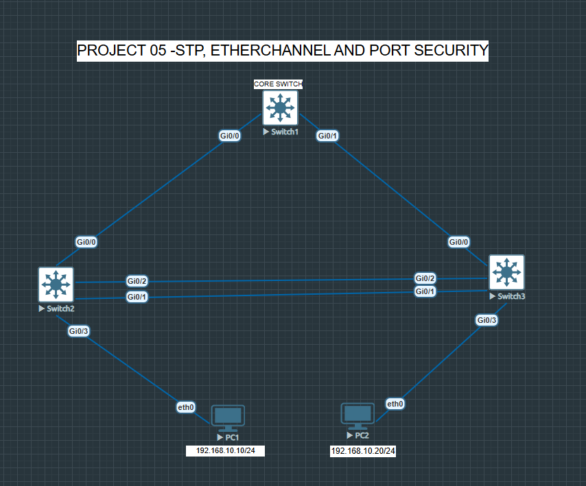

| Device   | Role         | Key Interfaces                          |
|----------|--------------|-----------------------------------------|
| Switch1  | Core / Root  | Gi0/0 → SW2, Gi0/1 → SW3               |
| Switch2  | Distribution | Gi0/0 uplink, Gi0/1-2 EC, Gi0/3 → PC1  |
| Switch3  | Distribution | Gi0/0 uplink, Gi0/1-2 EC, Gi0/3 → PC2  |
| PC1      | End device   | 192.168.10.10/24, GW 192.168.10.1       |
| PC2      | End device   | 192.168.10.20/24, GW 192.168.10.1       |

---

## Phase 1 — STP Root Bridge Election

### Objective
Force Switch1 to be the STP root bridge for VLAN 1 and verify correct port roles across all switches.

### Problem
Default IOS priority (32768) caused the wrong switch to be elected as root bridge.

### Fix
```
SW1(config)# spanning-tree vlan 1 priority 0
```

### Verification
```
SW1# show spanning-tree vlan 1
```

**Expected output on Switch1:**
- Root ID = Bridge ID (same MAC address)
- `This bridge is the root`
- All interfaces: Designated / FWD

**Switch2 output:**
- Gi0/0 = Root / FWD (toward Switch1)
- Gi0/1, Gi0/2 = Designated / FWD

### Screenshots

| Before | After |
|--------|-------|
| 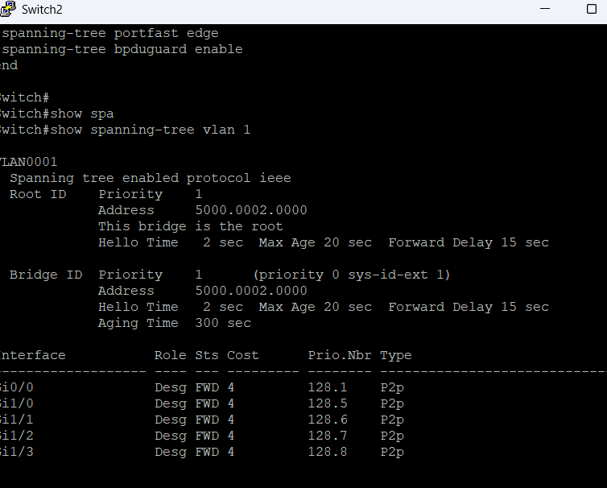 | 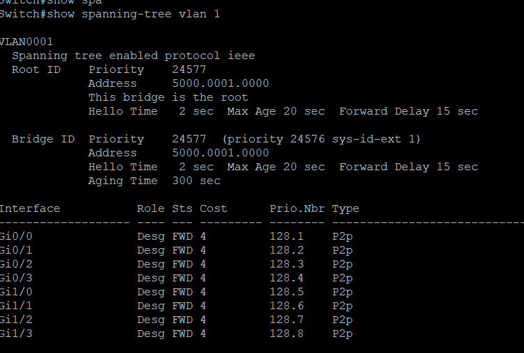 |
| Wrong switch elected as root | Switch1 confirmed root (Priority 24577) |

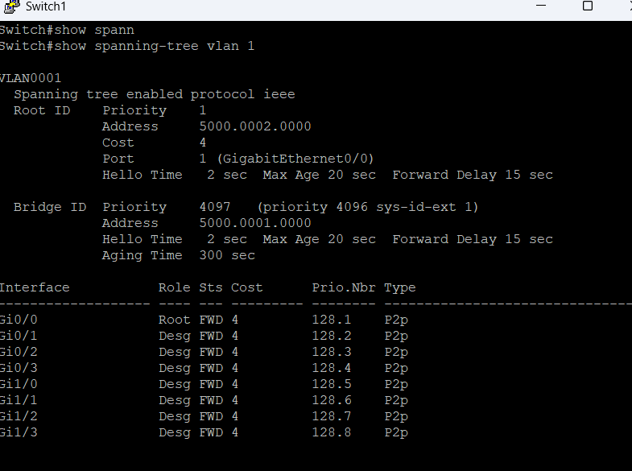
*Switch2 — Root port Gi0/0, all others Designated/FWD*

---

## Phase 2 — EtherChannel (LACP)

### Objective
Bundle Gi0/1 and Gi0/2 between Switch2 and Switch3 into a single logical Port-channel using LACP.

### Configuration
```
! Switch2
SW2(config)# interface range gi0/1 - 2
SW2(config-if-range)# channel-group 1 mode active
SW2(config-if-range)# exit
SW2(config)# interface port-channel 1
SW2(config-if)# switchport mode trunk

! Switch3
SW3(config)# interface range gi0/1 - 2
SW3(config-if-range)# channel-group 1 mode passive
SW3(config-if-range)# exit
SW3(config)# interface port-channel 1
SW3(config-if)# switchport mode trunk
```

### Fault Injection & Troubleshooting

Introduced a deliberate misconfiguration causing:
```
%EC-5-L3DONTBNDL2: Gi0/2 suspended: LACP currently not enabled on the remote port
```
**Root cause:** Mode mismatch — both sides needed to be compatible (active/passive or active/active).

**show etherchannel summary — failure state:**
```
Group  Port-channel  Protocol   Ports
------+-------------+----------+-----------------
1      Po1(SD)       LACP       Gi0/1(s) Gi0/2(s)
```
`SD` = Layer2, Down | `s` = suspended

**show etherchannel summary — fixed state:**
```
Group  Port-channel  Protocol   Ports
------+-------------+----------+------------------
1      Po1(SU)       LACP       Gi0/1(P) Gi0/2(P)
```
`SU` = Layer2, In Use | `P` = Bundled in port-channel

### Verification Commands
```
SW2# show etherchannel summary
SW2# show lacp neighbor
SW2# show interfaces port-channel 1
```

**Key outputs:**
- Port-channel1: up, line protocol up
- BW 2000000 Kbit/sec (2 Gbps — aggregate of 2 x 1G)
- LACP neighbor flags: `SA` = Slow LACPDUs, Active mode

### Screenshots

| Failure — SW2 | Failure — SW3 |
|---------------|---------------|
| 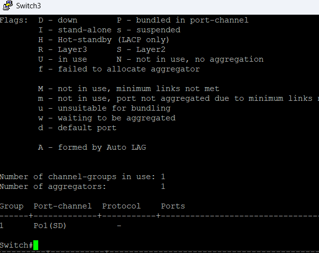 | 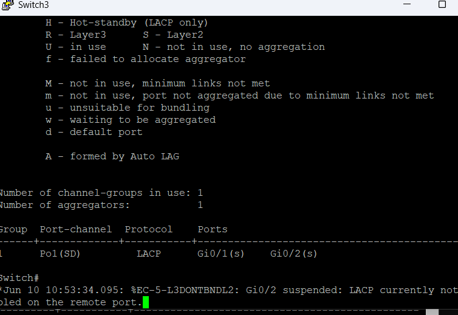 |
| Po1(SD) — bundle down | Gi0/2 suspended, LACP error |

| Fixed | Summary |
|-------|---------|
| 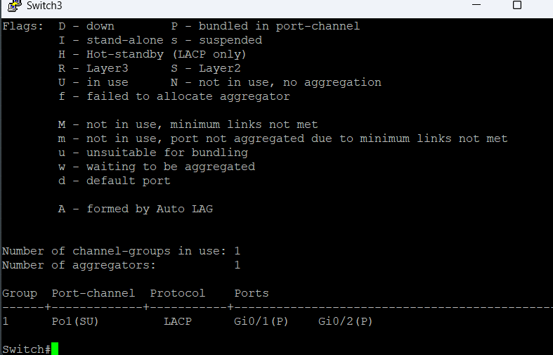 | 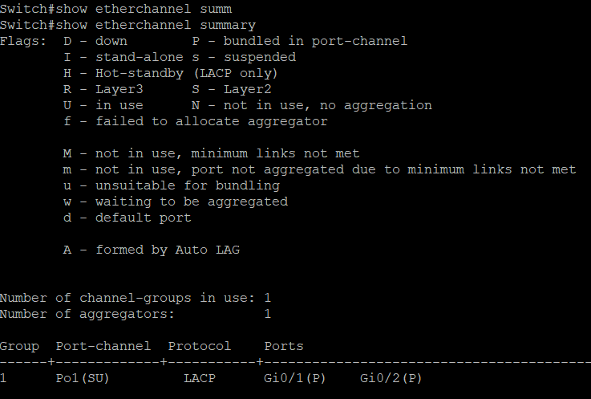 |
| Po1(SU) — both ports bundled (P) | show etherchannel summary |

| LACP Neighbor | Port-Channel Interface |
|---------------|----------------------|
| 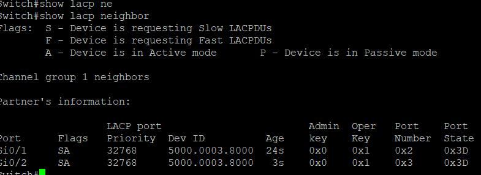 | 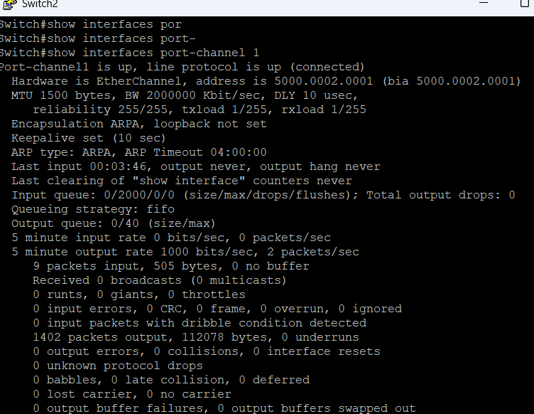 |
| Flags SA — Slow + Active mode | Port-channel1 up, BW 2Gbps |

---

## Phase 3 — Port Security

### Objective
Protect PC-facing access ports (Gi0/3 on Switch2 and Switch3) from unauthorized MAC addresses. Enable PortFast for fast convergence and BPDU Guard for rogue switch protection.

### Configuration (applied to both SW2 and SW3 Gi0/3)
```
SW2(config)# interface gi0/3
SW2(config-if)# switchport mode access
SW2(config-if)# switchport access vlan 10
SW2(config-if)# switchport port-security
SW2(config-if)# switchport port-security mac-address sticky
SW2(config-if)# spanning-tree portfast edge
SW2(config-if)# spanning-tree bpduguard enable
```

### Verification
```
SW2# show port-security interface gi0/3
SW2# show run interface gi0/3
```

**Expected output:**
```
Port Security              : Enabled
Port Status                : Secure-up
Violation Mode             : Shutdown
Maximum MAC Addresses      : 1
Sticky MAC Addresses       : 0
Security Violation Count   : 0
```

### Key Notes
- **Sticky MAC** — dynamically learns the first connected MAC and stores it in running config. Survives port flaps until cleared.
- **Shutdown violation** — err-disables the port immediately if an unauthorized MAC is detected. Requires manual `shutdown` / `no shutdown` to recover.
- **PortFast edge** — bypasses STP listening/learning on access ports. PC connects immediately instead of waiting 30 seconds.
- **BPDU Guard** — if a BPDU is received on a PortFast port (rogue switch plugged in), the port is immediately err-disabled.

### Screenshots

| Config | Status |
|--------|--------|
| 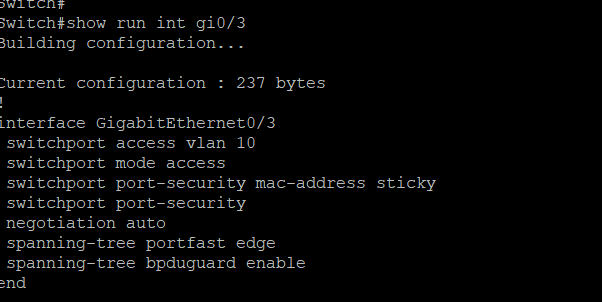 | 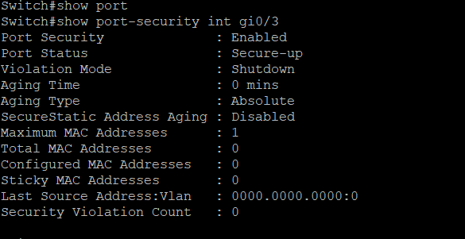 |
| Running config: portfast edge + bpduguard | SW2 Gi0/3: Secure-up, Shutdown mode |

| Show port-security | Violation count |
|--------------------|-----------------|
| 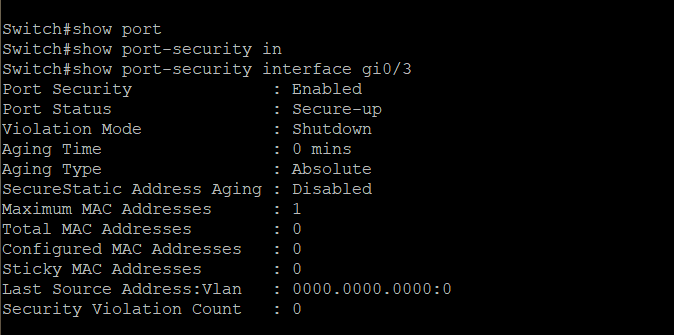 |  |
| SW3 Gi0/3: port-security enabled | Violation count: 0 — no breach |

---

## Phase 4 — End-to-End Connectivity Verification

```
PC2> ip 192.168.10.20 255.255.255.0 192.168.10.1
PC2> ping 192.168.10.10
```

**Result:**
```
84 bytes from 192.168.10.10  icmp_seq=1  ttl=64  time=16.700 ms
84 bytes from 192.168.10.10  icmp_seq=2  ttl=64  time=30.171 ms
84 bytes from 192.168.10.10  icmp_seq=3  ttl=64  time=28.177 ms
84 bytes from 192.168.10.10  icmp_seq=4  ttl=64  time=25.828 ms
84 bytes from 192.168.10.10  icmp_seq=5  ttl=64  time=18.448 ms
```

5/5 pings successful. Zero packet loss. Confirms full L2 reachability across the EtherChannel trunk with correct STP forwarding state and VLAN 10 consistency.

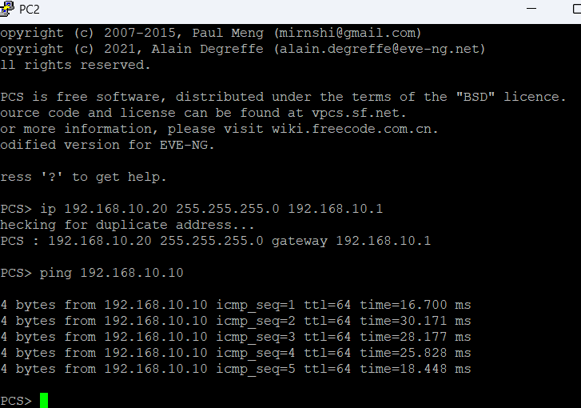

---

## Key Verification Commands Reference

| Goal | Command |
|------|---------|
| Check STP root & port roles | `show spanning-tree vlan 1` |
| Verify EtherChannel bundle state | `show etherchannel summary` |
| Check LACP negotiation | `show lacp neighbor` |
| Port-channel interface stats | `show interfaces port-channel 1` |
| Port security status | `show port-security interface gi0/3` |
| Running config of interface | `show run interface gi0/3` |

---

## Skills Demonstrated

- STP PVST+ root bridge manipulation via priority tuning
- STP port role identification (Root, Designated, Blocked)
- LACP EtherChannel configuration and fault diagnosis
- Reading `show etherchannel summary` flags (SU, SD, P, s, D)
- Layer 2 port security with sticky MAC and shutdown violation
- PortFast and BPDU Guard for edge port hardening
- EVE-NG lab build, IP addressing, and end-to-end verification

---

## Tools & Environment

- **Simulator:** EVE-NG Community Edition
- **Devices:** Cisco IOSv (L2) switches × 3, VPCS hosts × 2
- **Protocol:** IEEE 802.3ad (LACP), IEEE 802.1D (STP/PVST+)
- **VLAN:** VLAN 10 (192.168.10.0/24)

---

*Part of [cjbarnes29/ccna-networking-portfolio](https://github.com/cjbarnes29/ccna-networking-portfolio)*
